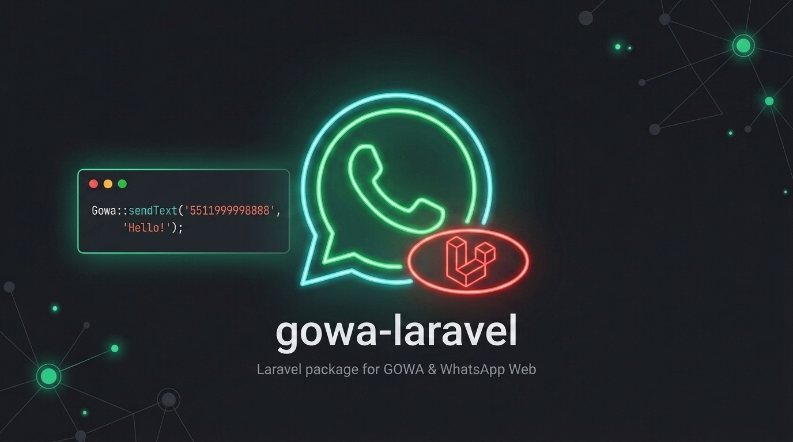

<div align="center">
  

  # gowa-php/laravel

  **Integração do GOWA para Laravel — Facade, Channel de Notificação, Roteamento de Webhooks e Models Eloquent**

  [](https://packagist.org/packages/gowa-php/laravel)
  [](https://packagist.org/packages/gowa-php/laravel)
  [](LICENSE)
  [](https://php.net)
  [](https://laravel.com)

</div>

---

> 🇺🇸 Para ler a documentação em Inglês, acesse [README.md](README.md).

---

## ⚡ Agradecimentos e Dependências

Este pacote interage com o ecossistema backend em Go criado pela comunidade open-source:

- **[whatsmeow](https://go.mau.fi/whatsmeow)** — Biblioteca Go criada por [Tulir Asokan](https://github.com/tulir) que faz a engenharia reversa do protocolo WebSocket do WhatsApp Web Multi-Device e criptografia Signal.
- **[go-whatsapp-web-multidevice (GOWA)](https://github.com/aldinokemal/go-whatsapp-web-multidevice)** — O servidor API REST criado por [Aldino Kemal](https://github.com/aldinokemal) que expõe o `whatsmeow` via HTTP e Webhooks.
- **[gowa-php/sdk](https://packagist.org/packages/gowa-php/sdk)** — O SDK PHP base utilizado por este pacote de integração.

---

## Requisitos

- PHP >= 8.2
- Laravel 10, 11 ou 12
- [`gowa-php/sdk`](https://packagist.org/packages/gowa-php/sdk) ^1.0

## Instalação

```bash
composer require gowa-php/laravel
```

O Service Provider e a Facade `Gowa` são registrados automaticamente através do Package Discovery do Laravel.

Publique o arquivo de configuração:

```bash
php artisan vendor:publish --tag=gowa-config
```

Publique e execute as migrações (migrations):

```bash
php artisan vendor:publish --tag=gowa-migrations
php artisan migrate
```

## Configuração

```env
GOWA_BASE_URL=https://gowa.suaempresa.com
GOWA_USERNAME=admin
GOWA_PASSWORD=secret
GOWA_TIMEOUT=15
GOWA_WEBHOOK_SECRET=sua_chave_hmac_secret
GOWA_WEBHOOK_PATH=webhooks/gowa
```

## Como Usar

### Facade

```php
use Gowa\Laravel\Facades\Gowa;

// Enviar mensagem de texto
Gowa::sendText('5511999998888', 'Olá do Laravel!');

// Enviar mídia
use Gowa\Sdk\Dto\MediaPayload;
use Gowa\Sdk\Dto\MediaType;
use Gowa\Sdk\Dto\MediaUpload;

$media = new MediaPayload(
    type: MediaType::Document,
    upload: MediaUpload::fromPath('/caminho/para/fatura.pdf'),
);
Gowa::sendMedia('5511999998888', $media, 'Sua fatura');
```

### Channel de Notificação (Notification Channel)

Implemente `toGowa()` em sua notificação e `routeNotificationForGowa()` em sua entidade notificável (ex: modelo User):

```php
use Gowa\Laravel\Notifications\GowaMessage;

class OrderShipped extends Notification
{
    public function via(mixed $notifiable): array
    {
        return [\Gowa\Laravel\Notifications\GowaChannel::class];
    }

    public function toGowa(mixed $notifiable): GowaMessage
    {
        return GowaMessage::create("Seu pedido #{$this->order->id} foi enviado!");
    }
}

// No seu Model User:
public function routeNotificationForGowa(): string
{
    return $this->phone_number; // ex: '5511999998888'
}
```

### Eventos de Webhook

O pacote registra automaticamente uma rota POST em `{GOWA_WEBHOOK_PATH}/{deviceId}`. Ele valida a assinatura HMAC usando o `webhook_secret` armazenado no model `GowaInstance`, e dispara eventos tipados do Laravel.

Escute os eventos no `EventServiceProvider` ou usando a anotação `#[AsListener]`:

```php
use Gowa\Laravel\Webhook\Events\GowaMessageReceived;
use Gowa\Laravel\Webhook\Events\GowaMessageAck;
use Gowa\Laravel\Webhook\Events\GowaWebhookReceived;

// Qualquer webhook recebido (antes dos eventos específicos por tipo)
Event::listen(GowaWebhookReceived::class, function (GowaWebhookReceived $event) {
    Log::info('GOWA webhook', ['event' => $event->event->value, 'instance' => $event->instanceId]);
});

// Mensagem recebida
Event::listen(GowaMessageReceived::class, function (GowaMessageReceived $event) {
    $message = $event->message; // Gowa\Sdk\Webhook\Dto\IncomingMessage
    // processar mensagem...
});

// Confirmação de entrega/leitura de mensagem
Event::listen(GowaMessageAck::class, function (GowaMessageAck $event) {
    $ack = $event->ack; // Gowa\Sdk\Webhook\Dto\IncomingAck
    // atualizar status da mensagem...
});
```

### Models Eloquent

```php
use Gowa\Laravel\Models\GowaInstance;

// Buscar instância e verificar se está conectada
$instance = GowaInstance::where('device_id', 'meu-dispositivo')->firstOrFail();
$instance->status->isConnected(); // bool

// Criar um GowaClient direcionado para esta instância
$client = $instance->client();
$client->sendText('5511999998888', 'Olá!');

// Acessar conversas e mensagens
$instance->conversations()->with('messages')->get();
```

### Personalizando os Models

Aponte as configurações para suas próprias classes de Model (útil para adicionar relacionamentos ou colunas personalizadas):

```php
// config/gowa.php
'models' => [
    'instance'     => App\Models\WhatsappInstance::class,
    'conversation' => App\Models\WhatsappConversation::class,
    'message'      => App\Models\WhatsappMessage::class,
],
```

### Suporte a Multi-Tenant (Teams)

Habilite o escopo para múltiplos times/tenants adicionando a coluna `team_id` nas migrações:

```env
GOWA_TEAMS=true
GOWA_TEAM_FOREIGN_KEY=team_id
```

Publique e re-execute as migrações após ativar essa configuração.

## Executando os Testes

Por padrão, os testes são executados utilizando SQLite em memória sem a necessidade de contêineres ou serviços externos:

```bash
composer test
# ou explicitamente:
composer test:sqlite
```

Para executar a suíte de testes no MySQL e PostgreSQL utilizando o Docker:

```bash
# Subir os contêineres do MySQL e PostgreSQL
docker compose up -d

# Executar os testes para cada banco de dados
composer test:mysql
composer test:pgsql
```

## ⚠️ Isenção de Responsabilidade e Termos de Uso (Disclaimer)

Este software é uma biblioteca open-source desenvolvida para fins **educacionais, de pesquisa e laboratório de testes**.

- **Termos de Serviço de Terceiros**: Os usuários desta biblioteca são inteiramente responsáveis pelo cumprimento dos Termos de Serviço do WhatsApp, das Políticas da Plataforma Meta e dos termos de uso de quaisquer serviços de terceiros utilizados.
- **Envio Automatizado e Privacidade**: O envio automatizado ou não autorizado de mensagens pode violar os termos das plataformas. Cabe aos usuários garantir conformidade estrita com as leis de privacidade aplicáveis (ex: LGPD, GDPR), consentimento prévio dos destinatários e diretrizes das ferramentas.
- **Ausência de Garantias e Responsabilidade**: Este software é fornecido "como está" (*as is*), sem garantias de qualquer tipo, expressas ou implícitas. Os autores e contribuidores não se responsabilizam por eventuais bloqueios de números, banimentos de contas, perda de dados ou mau uso desta biblioteca.

## Licença

Este pacote é um software open-source licenciado sob a [Licença MIT](LICENSE).
